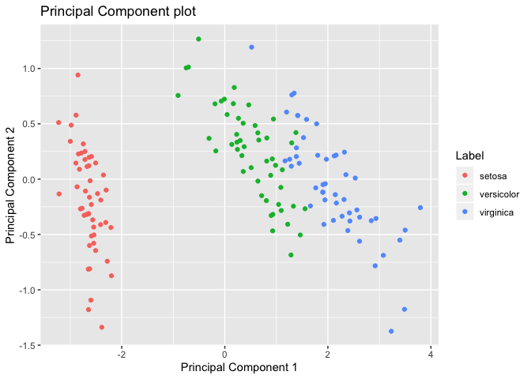

<!-- README.md is generated from README.Rmd. Please edit that file -->

# horus 

[](https://travis-ci.org/EmilHvitfeldt/horus)
[](https://ci.appveyor.com/project/EmilHvitfeldt/horus)
[](https://codecov.io/github/EmilHvitfeldt/horus?branch=master)
[](https://cran.r-project.org/package=horus)
[](https://CRAN.R-project.org/package=horus)
[](https://www.tidyverse.org/lifecycle/#experimental)

**WIP – Very early build, things are very likely to change – WIP**

The goal of horus is to allow quick visualization methods for common
machine learning and modeling tasks. This project is hugely inspired by
the Python library
[yellowbrick](https://github.com/DistrictDataLabs/yellowbrick).

## Installation

For the time being `horus` is only available on Github, and can be
installed with `devtools`:

``` r
# install.packages('devtools')
devtools::install_github('EmilHvitfeldt/horus')
```

In the future the package will be available on CRAN as well.

## Example

There is no reason why a principal component plot of a dataset should be
as hard as it corrently is in R. Using **horus** it is down to a single
line\!

``` r
library(horus)
viz_pca(iris, Species)
```

<!-- -->
